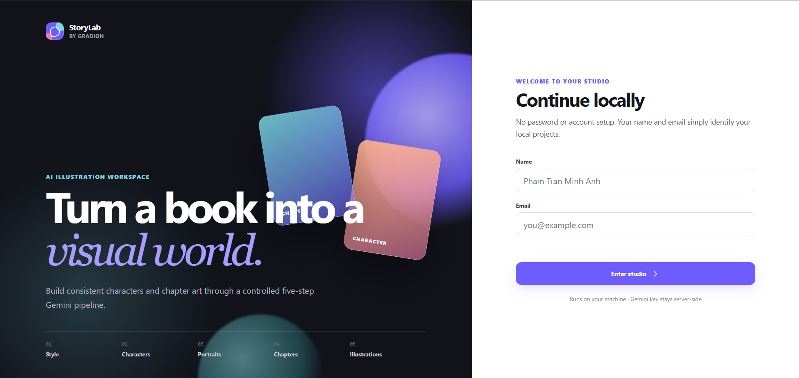
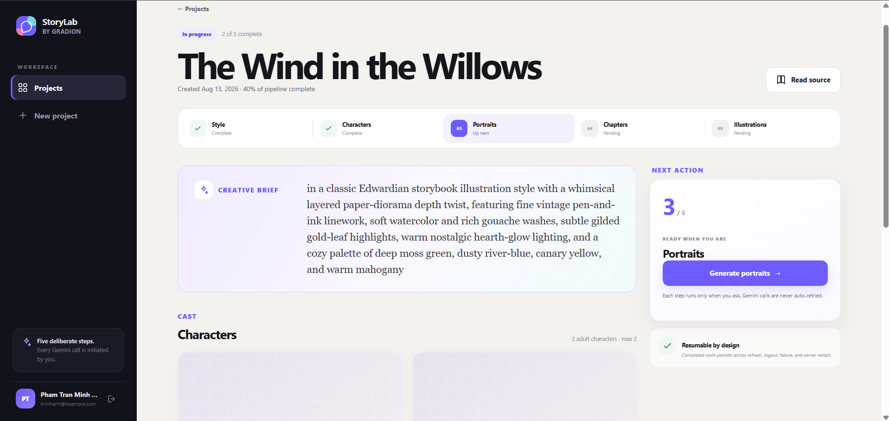
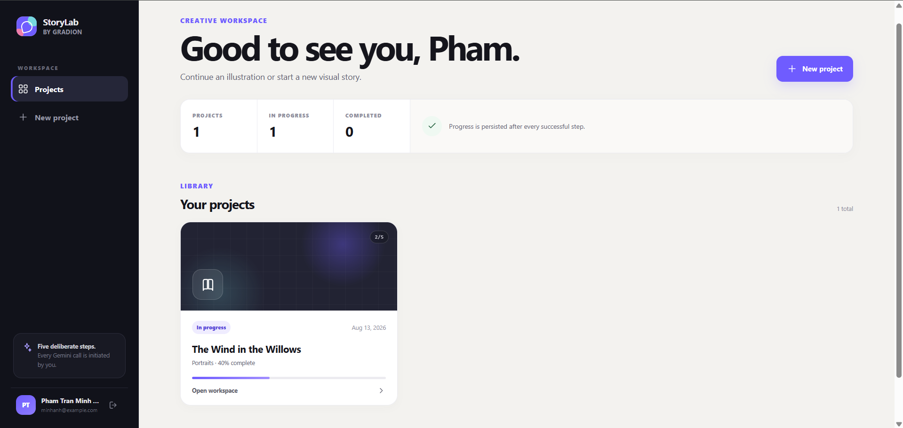

# Book Illustration Studio

A local full-stack implementation of Gradion's Intern Fullstack Developer take-home assessment. 

The idea is: a user pastes in a book, then moves through a five-step workflow to turn that text into a visual direction, character descriptions, character portraits, a chapter prompt, and finally a chapter illustration.

The app intentionally stays small: one Node.js process serves the API and the browser UI, while users, sessions, project state, book text, and generated images are persisted on the local filesystem. There is no build step and no database service to install.

## Demo





*Project workspace showing the five-step illustration pipeline, generated character portraits, and chapter artwork.*

## Run it

### Prerequisites

- Node.js 22+
- A Gemini API key for real generation

Copy the environment template and add your key:

```bash
cp .env.example .env
# edit .env and set GEMINI_API_KEY
```

Then the **one command to start the stack** is:

```bash
./start.sh
```

Open `http://localhost:3000`.

For an offline click-through that exercises the real server/state machine without spending Gemini quota:

```bash
GEMINI_MOCK=true ./start.sh
```

The **one command to run all tests** is:

```bash
./test.sh
```

No Docker Compose is needed: there is one Node process and local disk storage only.

## Environment variables

| Variable | Required | Default | Purpose |
| --- | --- | --- | --- |
| `GEMINI_API_KEY` | Yes for real calls | — | Gemini API key; never committed |
| `GEMINI_TEXT_MODEL` | No | `gemini-3.6-flash` | Text/structured-output model |
| `GEMINI_IMAGE_MODEL` | No | `gemini-3.1-flash-lite-image` | Nano Banana-family image model |
| `PORT` | No | `3000` | Local HTTP port |
| `DATA_DIR` | No | `./data` | Persistent local files |
| `STALE_STEP_MS` | No | `300000` | Recovery threshold for a stranded running step |
| `GEMINI_MOCK` | No | `false` | Deterministic offline Gemini adapter for UI/testing |

Model IDs are environment variables because Gemini model availability changes. The defaults match the current Google cookbook used while implementing this assessment; if a model is unavailable to the reviewer's project, it can be changed without touching application code.

## Architecture

```text
Browser (plain JS + CSS)
        │ JSON / polling
        ▼
Node HTTP server
  ├─ session + project API
  ├─ pipeline state machine
  ├─ Gemini REST adapter
  └─ filesystem store
       ├─ users.json / sessions.json
       ├─ projects/<id>.json
       ├─ books/<id>.txt
       └─ images/<project>/<kind>/<n>.*
```

### Why this shape

The hard part of this assessment is durable pipeline behavior, not framework plumbing. Project state is written atomically and every project mutation runs through a keyed mutex. The server marks a step `RUNNING` **before** the Gemini request begins, so a refresh, second tab, or double-click sees the same persisted run and cannot launch another call. A server restart leaves that state intact; once the run exceeds the configured stale threshold, the UI exposes an explicit recovery action.

`completedStep` and `run` are independent. That lets the project truthfully express states such as “Portraits are complete, Chapters is currently running” or “Characters failed on attempt 2” without collapsing everything into one status enum.

See [`docs/architecture.md`](docs/architecture.md) for the data flow and invariants.

## Gemini pipeline

The implementation follows the first five steps of Google's **Book illustration** notebook and maps them to the current REST APIs:

1. **Style**: upload the `.txt` source using the Files API if it has not been uploaded yet; create the initial book interaction; then chain the style interaction with `previous_interaction_id`.
2. **Characters**: chain from the style interaction and request structured JSON. The server independently truncates the result to **2 adult characters**.
3. **Portraits**: create a separate image interaction context and generate portraits sequentially, chaining each image interaction from the prior one for visual consistency. Each finished portrait is saved immediately.
4. **Chapters**: chain the text interaction from the character-prompt interaction and request structured JSON. The server independently truncates the result to **1 chapter**.
5. **Illustrations**: continue from the last portrait image interaction and generate the chapter scene so the established character appearances stay in context.

The book is not sent again on later steps. Failed calls are **not automatically retried**; retry is always an explicit user action.

## API outline

- `POST /api/session` — create/load identity and session
- `GET /api/session` — current identity
- `DELETE /api/session` — sign out
- `GET /api/projects` — current user's project list
- `POST /api/projects` — create project from title + book text
- `GET /api/projects/:id` — detail + full source text
- `POST /api/projects/:id/steps/:STEP` — start the next allowed step
- `POST /api/projects/:id/recover` — clear a stale running marker
- `/generated/...` — locally stored generated images

Internal Gemini interaction IDs are deliberately not exposed to the browser.

## Important pipeline behavior

- Five steps are user-triggered and strictly ordered.
- 2-character / 1-chapter limits are enforced in both structured-output schemas **and** the server's post-processing.
- A duplicate step start returns HTTP `409` without invoking Gemini.
- Completed data survives refresh, sign-out, and server restart.
- A failed step does not advance `completedStep`.
- Portraits/illustrations are persisted item-by-item, so a retry skips items that already exist.
- A stale running step requires explicit recovery; no background or automatic Gemini retry occurs.
- Book text and generated images are served through this app from local disk.

## Testing

`./test.sh` runs Node's built-in test runner. The suite covers backend pipeline rules and frontend state-rendering logic without consuming Gemini quota. The committed report is in [`TESTING.md`](TESTING.md).

For a manual smoke test without quota:

1. Start with `GEMINI_MOCK=true ./start.sh`.
2. Sign in with any valid local name/email.
3. Create a project from pasted text or a `.txt` file.
4. Run all five steps, refreshing between steps if desired.
5. During a running step, open the same project in another tab and try the action again; the server keeps the original run authoritative.

## Scope

This is a local assessment project, not a production deployment.

Authentication is intentionally lightweight, files are stored locally, and generated assets remain on disk. A production version would need stronger authentication, hosted storage, a transactional database, and deployment-specific security work.

Those were left out intentionally so the implementation could stay focused on the workflow, persistence, failure handling, and Gemini integration required by the assessment.
